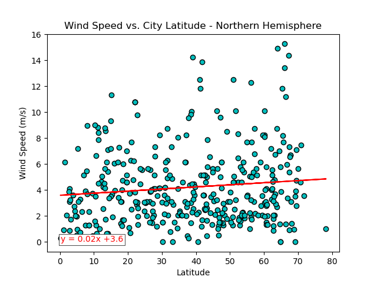

# Python API Challenge

# Background
Data's true power is its ability to definitively answer questions. So, let's take what you've learned about Python requests, APIs, and JSON traversals to answer a fundamental question: "What is the weather like as we approach the equator?"
Now, we know what you may be thinking: “That’s obvious. It gets hotter.” But, if pressed for more information, how would you prove that?

# Part 1: WeatherPy

## Generate the Cities List by Using the `citipy` Library

## Requirement 1: Create Plots to Showcase the Relationship Between Weather Variables and Latitude

### Use the OpenWeatherMap API to retrieve weather data from the cities list generated in the started code

### Create a DataFrame with the retrieved weather data

### Create the Scatter Plots Requested

## Requirement 2: Compute Linear Regression for Each Relationship

### Create a DataFrame for the Northern Hemisphere

### Create a DataFrame for the Southern Hemisphere

### Temperature vs. Latitude Linear Regression Plot

Analysis:
- The r-value > 0.7 for both hemispheres shows that there is a strong correlation between the latitude where the city is located and the maximum temperature.
- This correlation can be seen on how the observations are around the regression line.
- The closest the cities get to the equator the highest the maximum temperature is. This is shown with the negative correlation in the northern hemisphere and with the positive correlation in the southern hemisphere.

# Humidity vs. Latitude Linear Regression Plot

Analysis:
- The r-value < 0.3 shows there is a very week correlation between the latitude and the humidity.
- This means there is no relation between the distance to the equator and the city humidity %.

# Cloudiness vs. Latitude Linear Regression Plot

Analysis:
- The r-value < 0.3 shows there is a very week correlation between the latitude and the cloudiness.
- This means there is no relation between the distance to the equator and the city cloudiness.

# Wind Speed vs. Latitude Linear Regression Plot

Analysis:
- The r-value < 0.3 on the northern hemisphere and < 0.5 in the southern hemisphere show there is a very weak and weak correlation respectively, between the latitude and the wind speed.
- This means there is no relation between the distance to the equator and the city wind speed.