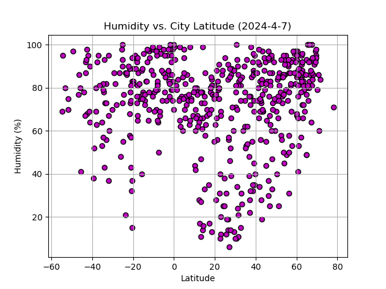
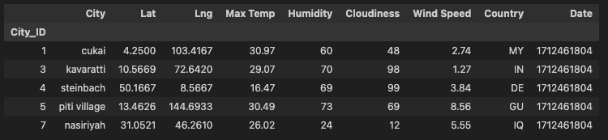
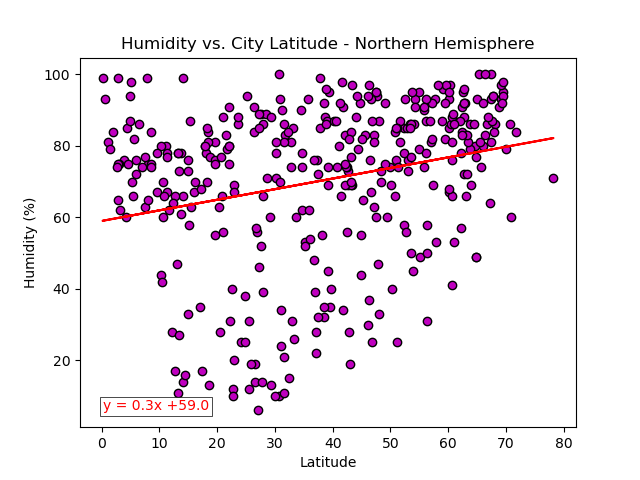
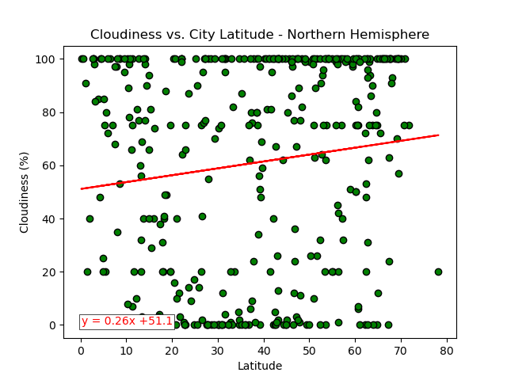
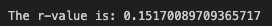
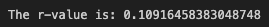
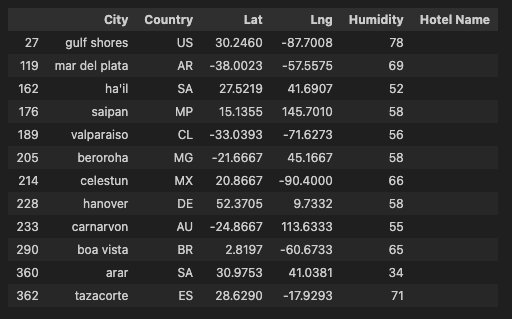

# Python API Challenge

# Background
Data's true power is its ability to definitively answer questions. So, let's take what you've learned about Python requests, APIs, and JSON traversals to answer a fundamental question: "What is the weather like as we approach the equator?"
Now, we know what you may be thinking: “That’s obvious. It gets hotter.” But, if pressed for more information, how would you prove that?

# Part 1: WeatherPy
In this deliverable, you'll create a Python script to visualize the weather of over 500 cities of varying distances from the equator. You'll use the citipy Python library, the OpenWeatherMap API, and your problem-solving skills to create a representative model of weather across cities.

For this part, you'll use the WeatherPy.ipynb Jupyter notebook provided in the starter code ZIP file. The starter code will guide you through the process of using your Python coding skills to develop a solution to address the required functionalities.

To get started, the code required to generate random geographic coordinates and the nearest city to each latitude and longitude combination is provided.

## 1. Generate the Cities List by Using the `citipy` Library

## 2. Create Plots to Showcase the Relationship Between Weather Variables and Latitude

### Use the OpenWeatherMap API to retrieve weather data from the cities list generated in the started code

### Create a DataFrame with the retrieved weather data

### Create the Scatter Plots Requested

## 3. Compute Linear Regression for Each Relationship

### Create a DataFrame for the Northern Hemisphere

### Create a DataFrame for the Southern Hemisphere

### Temperature vs. Latitude Linear Regression Plot

Analysis:
- The r-value > 0.7 for both hemispheres shows that there is a strong correlation between the latitude where the city is located and the maximum temperature.
- This correlation can be seen on how the observations are around the regression line.
- The closer the cities get to the equator the higher the maximum temperature is. This is shown with the negative correlation in the northern hemisphere and with the positive correlation in the southern hemisphere.

# Humidity vs. Latitude Linear Regression Plot

Analysis:
- The r-value < 0.3 shows there is a very week correlation between the latitude and the humidity.
- This means there is no relation between the distance to the equator and the city humidity %.

# Cloudiness vs. Latitude Linear Regression Plot

Analysis:
- The r-value < 0.3 shows there is a very week correlation between the latitude and the cloudiness.
- This means there is no relation between the distance to the equator and the city cloudiness.

# Wind Speed vs. Latitude Linear Regression Plot

Analysis:
- The r-value < 0.3 on the northern hemisphere and < 0.5 in the southern hemisphere show there is a very weak and weak correlation respectively, between the latitude and the wind speed.
- This means there is no relation between the distance to the equator and the city wind speed.

# Part 2: VacationPy

In this deliverable, you'll use your weather data skills to plan future vacations. Also, you'll use Jupyter notebooks, the geoViews Python library, and the Geoapify API.
The code needed to import the required libraries and load the CSV file with the weather and coordinates data for each city created in Part 1 is provided to help you get started.
Your main tasks will be to use the Geoapify API and the geoViews Python library and employ your Python skills to create map visualizations.

## 1. Create a map that displays a point for every city in the city_data_df DataFrame as shown in the following image. The size of the point should be the humidity in each city.

## 2. Narrow down the `city_data_df` DataFrame to find your ideal weather conditions.
Max Temp between 17 and 32 degrees
Humidity between 30 and 80
Cloudiness equal to 0

## 3. Create a new DataFrame called `hotel_df`.

## 4. For each city, use the Geoapify API to find the first hotel located within 10,000 metres of your coordinates.

## 5. Add the hotel name and the country as additional information in the hover message for each city in the map.
